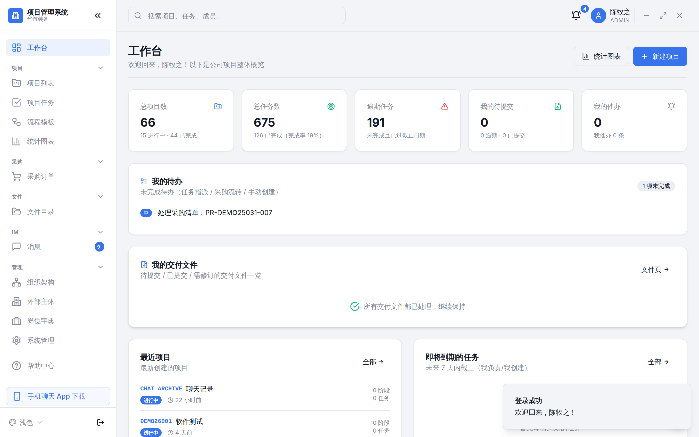
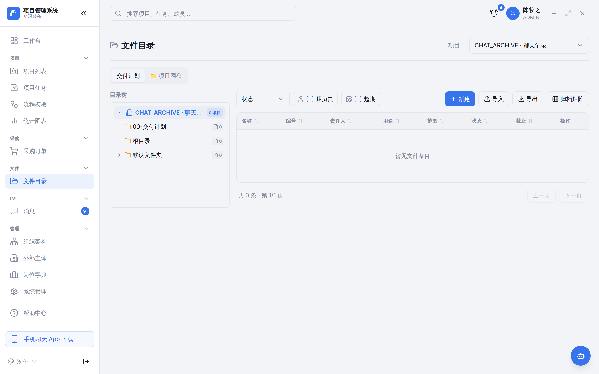
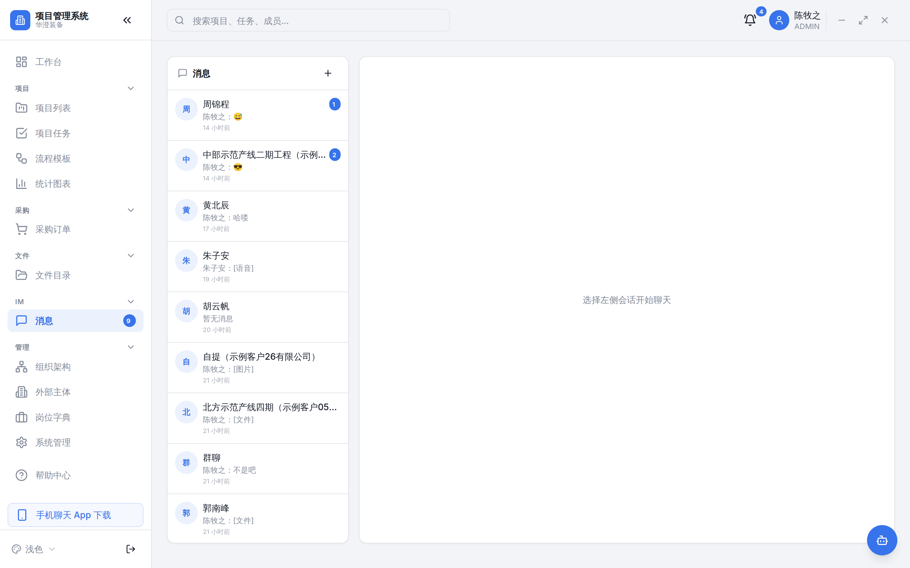
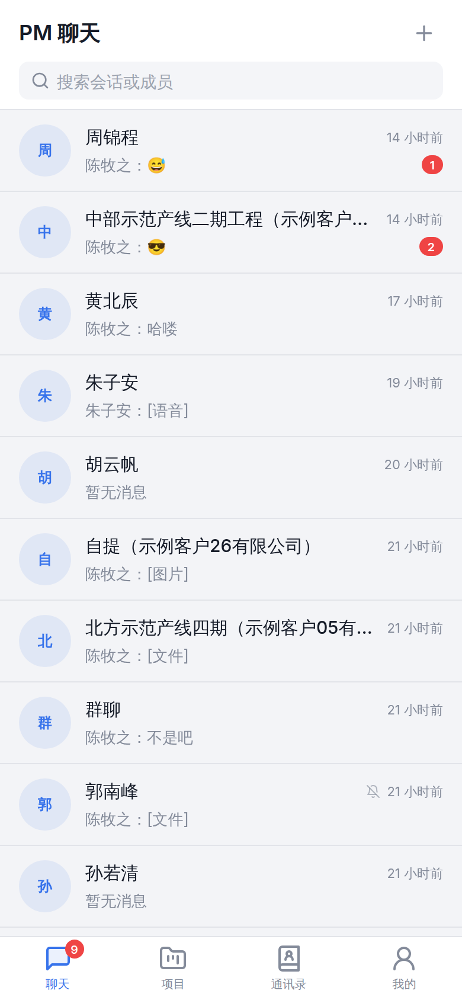

# PM 项目管理系统 + 企业即时通讯（IM）

面向工程项目型企业的**开源**管理系统：项目全生命周期（阶段 / 任务 / 文件 / 采购 / 费用）+ 内置企业微信式即时通讯，含独立 Android App。

[](./LICENSE)
[](https://nextjs.org)
[](https://www.typescriptlang.org)
[](https://socket.io)

> 🔑 **在线体验**：<https://pm.hezongji.cn> · 演示账号 `chenmuzhi` / `demo123456`
> 📦 **Android App 下载**：<https://github.com/hezongji/project-management-system/releases>

## 功能概览

### 移动端（手机浏览器 / Android App）
- 全站移动优先适配：底部 Tab 导航（首页/项目/待办/我的）+ 微信式卡片流，12 个主页面全部适配（工作台/项目/任务/待办/采购/文件/组织/设置/帮助/IM）
- 采购审批移动端完整保留（底部抽屉 Sheet 卡片流，审批流程/金额口径零改动）
- 双 Android App（Kotlin WebView 壳）：**PM 项目管理**（全功能主站）+ **PM 聊天**（专注 IM）
- 六套主题（浅色/暖阳/晴蓝/薄荷/深空蓝/暖夜）全平台生效，主按钮/Logo 渐变点缀

### 项目管理系统（Web）
- 项目管理：项目台账、阶段、任务、交付物
- 采购管理：采购申请、供应商、订单、到货
- 费用管理：报销单
- 组织架构、权限分配、帮助中心、质检驾驶舱

### 文件管理（项目网盘）
- 目录树：一棵树融合制——阶段/系统目录（受保护）与用户自建目录并存；物理路径解耦，移动文件仅改 `folderId`，零文件搬迁
- 网盘视图：左树右列表、面包屑导航、拖拽移动、多文件上传、批量下载（zip 流式打包）
- 版本管理：同名文件自动版本合并、版本徽章、版本历史浏览
- 回收站：软删 + 30 天保留期，可恢复 / 彻底删除，定时任务自动清理
- 全局搜索：跨项目文件名检索
- 权限：项目成员 / 管理者 / 所有者分级 ACL，目录权限沿祖先链并集判定

### 即时通讯（IM）
- 网页端 `/messages` + 独立 Android App「PM 聊天」（WebView 壳）
- 会话：单聊 / 群聊 / 项目群（成员自动=项目成员）
- 消息：文字、图片、文件、语音、@提及、@所有人、引用回复、撤回、多选转发删除
- 通讯录：公司组织架构（部门树）+ 项目通讯录，点人直接开聊、多选建群
- 附件自动归档：项目群附件自动入项目文件夹，普通聊天附件入「聊天记录」共享文件夹
- 群公告、消息免打扰、会话置顶/删除、未读聚合

## 界面预览

| 工作台 | 文件管理（项目网盘） |
|:---:|:---:|
|  |  |

| IM 聊天（网页端） | 移动 App（Android） |
|:---:|:---:|
|  |  |

## 技术栈

| 层 | 技术 |
|----|------|
| 前端 | Next.js 16 (App Router) + React + TypeScript + Tailwind CSS + TanStack Query |
| IM 后端 | Node.js + Socket.IO（独立进程 `im-server`） |
| 数据库 | PostgreSQL + Prisma |
| Android App | Kotlin WebView 壳（`mobile-app/`），原生 MediaRecorder 录音桥 |

## 架构

```
┌─ PM 网页 (Next.js :3001) ── 项目管理 / IM 页面 / REST API
│        │ 共享 PostgreSQL（User/Conversation/Message/File...）
│        │ 共享 JWT_SECRET
├─ im-server (Socket.IO :3002) ── 实时消息推送
└─ mobile-app (Android WebView 壳) ── 加载 /im，原生录音 JS 桥
```

关键设计：IM 与 PM 系统**共享同一数据库与 JWT 体系**，App 与网页消息天然同步，无需额外同步机制。

## 快速开始

```bash
# 1. 安装依赖
npm install
cd im-server && npm install && cd ..

# 2. 配置环境变量（复制示例，填入真实值）
cp .env.example .env
cp im-server/.env.example im-server/.env

# 3. 初始化数据库
npx prisma migrate deploy
npx prisma db seed

# 4. 启动
npm run dev            # PM 主服务（:3000）
cd im-server && node src/index.js   # IM 服务（:3002）
```

> ⚠️ `.env` 文件含敏感配置（数据库密码、JWT_SECRET、AI key），已加入 `.gitignore`，切勿提交。

## Android App

两个独立的 Kotlin WebView 壳 App，可直接从 [Releases](https://github.com/hezongji/project-management-system/releases) 下载安装 APK：

| App | 工程 | applicationId | 加载目标 |
|-----|------|---------------|---------|
| PM 项目管理 | `pm-app-android/` | `com.hezongji.pmapp` | https://pm.hezongji.cn/（主站，移动端已适配） |
| PM 聊天 | `mobile-app/` | `com.hezongji.pmchat` | https://pm.hezongji.cn/im（IM 专页） |

> 安装自签 APK 需在系统设置中允许「安装未知来源应用」；若浏览器/系统提示风险，属自签证书正常现象。

### 自行构建（服务器需 JDK 17 + Android SDK + Gradle）

```bash
# PM 聊天（mobile-app/）
bash scripts/build-apk.sh   # 产出 mobile-app/app/build/outputs/apk/release/pm-chat-<version>.apk

# PM 项目管理（pm-app-android/，同法在对应目录执行 gradle assembleRelease）
cd pm-app-android && gradle assembleRelease
```

首次构建会生成自签 keystore（已 gitignore），**请务必异地备份**——丢失会导致已装用户必须卸载重装。

## 部署

参考 `deploy/`（Docker Compose 全栈编排）与 `k8s/`（Kubernetes 示例）。生产环境务必：
- 替换所有 `.env` / `k8s/secrets.yaml` 占位符为真实强随机值
- nginx 配置 APK 分发目录与 Socket.IO WebSocket 升级（见 `deploy/nginx.conf`）

## 目录结构

```
src/            PM 主服务（Next.js 页面 + API + IM 前端组件）
im-server/      独立 IM 实时服务（Socket.IO）
mobile-app/     Android WebView 壳（原生录音桥）
prisma/         数据库 schema 与迁移
scripts/        打包 / QA 回归 / 验证脚本
deploy/         Docker 部署
k8s/            Kubernetes 示例
```

## 许可证

[MIT](./LICENSE)
